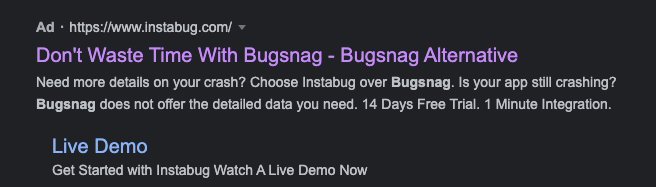

<!--
published: true
slug: building-an-arcade
-->
# Building an Arcade

Just some random text

<div class="double images">
  
  
</div>

some `code` here

## Some code!

```go
# some comment
go func() {
  fmt.Println("something")
}()
```


```ahk
; some comment
Gui, Show
Send C
MsgBox Say something
Return
```

Look at the [other page](./LEDBlinkey.md)
